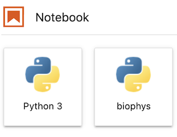

# Part 0: Setup

We will **only** be using Python for the programming component of this course.
Python is a great starter language and is open-source.
It is also versatile and ubiquitous among science and industry.
We don't expect you to become Python experts by the end of the class.
Instead, our goal is to have you see programming as an indispensible tool in your toolkit which allows you to express (scientific) ideas and creativity.
Most computers and operating systems nowadays have a preinstalled version of Python.
However, because these tend to be outdated and are not as manageable as other options for many reasons, we will be using Conda, a package and environment management system, to install Python. Specifically, we will be using Miniconda. 

*You may be familiar with Anaconda.
Installing Anaconda takes a nontrivial amount of disk space and almost certaintly contains many packages that you will never use.
On the other hand, installing Miniconda loads the minimal amount of software necessary for installing whatever packages you might need later on.
If you decide to go forward with programming and work on high performance computers or servers, Miniconda is typically the much more manageable management system, so we use it here.*

## Installing Miniconda

Navigate to the [Miniconda website](https://docs.conda.io/en/latest/miniconda.html#latest-miniconda-installer-links).
This should direct to the part of the page with the heading **Latest Miniconda Installer Links**.
Click the hyperlink appropriate for whatever platform and bit version your machine has.
(If you have MacOSX, click the `pkg` link.)
Follow the instructions there and pick whatever options are indicated as the default by the installer.

## Setting up the environment
At this point, we should now have the barebones Miniconda.
There is a file called `env.yml` in this directory (StatPhysBio/biophysics/part0/ on github).
This is a configuration file which tells Miniconda to create a virtual environment called `biophys2022` and installs all the packages that we foreseeably need for this course.
The following are the steps for creating the environment:


1. Click `env.yml` and then click `raw`.
Right-click, select `Save page as`.
A new window should pop up.
Specify you want the file saved to your `Downloads` folder.
There should also be a dropdown menu near the bottom center called "Format" or something similar.
Make sure you select the format as "All Files" instead of "Text Files" otherwise `env.yml` will be saved as `env.yml.txt`.
Finally click `Save` to save the file as `env.yml`.
2. On Microsoft machines, start up the `Anaconda prompt` program; on MacOSX/Linux machines, start up `Terminal`.
3. Navigate to where this file is saved.
E.g., `cd "Downloads"` on Microsoft machines and `cd ~/Downloads` for MacOSX/Linux machines.
4. Type `conda env create -f env.yml`.
    - If this is not working, the `env.yml` file might have been saved with an additional (hidden) extension, so it may have been saved as `env.yml.txt`.
    To check this, type `dir env*` on Microsoft machines or `ls env*` for MacOS/Linux machines and press Enter.
    This should bring up any files in your Downloads directory which have 'env' has its first three letters.
    See if `env.yml` was actually saved as `env.yml.txt`.
    If it was, type `move env.yml.txt env.yml` on Microsoft machines or `mv env.yml.txt env.yml` on MacOS/Linux machines.
    This essentially renames the file.
    Try `conda env create -f env.yml` again.
6. This process may take a few minutes.
You may hear your computers fans whirring.
At some point, you may be prompted with `Proceed ([y]/n)?` in which case you should type `y` and press enter.

If all goes well, you should see

```bash
To activate this environment, use

    $ conda activate biophys2022

To deactivate an active environment, use
    
    $ conda deactivate
```

*When you type these things in Anaconda Prompt or Terminal, you don't type the $.
That's just there to indicate which type of shell you're running--essentially it is out of the scope of this tutorial.
Just know when you see a $, you don't actually type one.*

We have now created a virtual envinroment called `biophys2022`.
Activating this environment lets you use the Python and packages specific to what we installed.
Using virtual environments is a good habit.
Practically speaking, many packages are developed with different versions of Python and different versions of other packages.
Notably, software can behave in starkly different ways depending on the version.
Virtual environments allow you to have many instances of Python (and packages) and therefore work on different projects without having conflicts.
Going forward, it is most likely ideal in terms of organization and sustainability to create a different environment for every project you do.

## Jupyter notebooks
There are many mediums for developing code.
A very user-friendly, interactive medium is the [Jupyter](https://jupyter.org/) notebook, in particular JupyterLab.
Jupyter notebooks allow you to develop code, conduct data exploration, and tell stories easily.
In short, using a Jupyter notebook can optimize your workflow, especially when it comes to scientific computing.

In the previous step, we created a virtual environment called `biophys2022`.
This virtual environment will not be recognized automatically by JupyterLab.
We must now install a kernel for our virtual environment manually.

In `Anaconda prompt` or `Terminal`, type the following

```bash
conda activate biophys2022
python -m ipykernel install --user --name biophys2022 --display-name "biophys2022"
```

Next, we want to launch JupyterLab. Type

```bash
jupyter lab
```

Note: anytime you want to start an instance of JupyterLab, you need to

1. Start `Anaconda prompt`/`Terminal`.
2. Type `jupyter lab` 

Among other things in the browser, we should see



Now, anytime you start a notebook for this class, click `biophys2022`.
It will allow you to use all the scientific computing packages that we installed in the `biophys2022`	virtual environment.

## Guidelines
That's all for the setup.
Now I'd like to share some guidelines for coding that I have found helpful over the years and that will hopefully be useful for the class and future programming.

1. When programming, the computer executes whatever it is programmed to do.
If it doesn't do what you expected, you (or whoever authored whatever package you're using) most likely coded up something incorrectly.
I.e., **if there are bugs in your code, it's almost undoubtedly your fault.**
2. Issues are fundamentally simple, and all numbers have to make sense.
3. If you don't know something or have an idea of what you'd like to do but don't know how to do it, Google it.
There's a good chance someone has already encountered the problem you have and someone else has already devised a good solution.
4. Well-written code essentially tells a story and has the following properties:
	* variables, functions, classes, etc. with **meaningful** names
	* modularity
	* functions which do only one thing and do it well
	* documentation which follows established conventions
	* comments only when their information cannot be obtained from reading code
	* nice formatting (imagine code which looks and reads like poetry with stanzas nicely and purposefully blocked and [enjambment](https://en.wikipedia.org/wiki/Enjambment) which makes sense and contributes positively to fluidity and legibility)
	* robust error handling (code defensively, expecting cases which fail)
5. Do not optimize your code prematurely.
Do not concern yourself with the best way to do something before you've coded it up successfully to begin with.
Over time, you will develop good habits and know how to code things efficiently.
For now, focus on programming something successfully first and then ask yourself are there other, perhaps better, ways of completing the task.
6. If you are debugging, it can be helpful to talk it out to a friend, classmate, your cat, [really anything](https://en.wikipedia.org/wiki/Rubber_duck_debugging).
This helps substantially in resolving any disconnects between what you think your code is doing and what it is actually doing.
